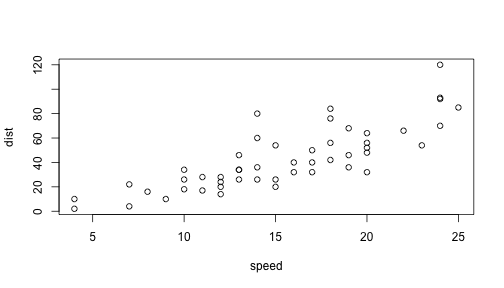

Title
===========================================

This is an R Markdown document. Markdown is a simple formatting syntax for authoring web pages (click the **MD** toolbar button for help on Markdown).

When you click the **Knit HTML** button a web page will be generated that includes both content as well as the output of any embedded R code chunks within the document. You can embed an R code chunk like this:


```r
summary(cars)
```

```
##      speed           dist    
##  Min.   : 4.0   Min.   :  2  
##  1st Qu.:12.0   1st Qu.: 26  
##  Median :15.0   Median : 36  
##  Mean   :15.4   Mean   : 43  
##  3rd Qu.:19.0   3rd Qu.: 56  
##  Max.   :25.0   Max.   :120
```


You can also embed plots, for example:


```r
plot(cars)
```

 


Lets check out writting sentences.


The current time is Sun Oct 20 12:17:44 2013. My favorite random number is -1.3244.

Now lets make a table.


```r
library(datasets)
data(airquality)
fit <- lm(Ozone ~ Wind + Temp + Solar.R, data = airquality)
```

Here is a table of regression coefficients.

```r
library(xtable)
xt <- xtable(summary(fit))
print(xt, type = "html")
```

<!-- html table generated in R 2.15.2 by xtable 1.7-1 package -->
<!-- Sun Oct 20 12:17:44 2013 -->
<TABLE border=1>
<TR> <TH>  </TH> <TH> Estimate </TH> <TH> Std. Error </TH> <TH> t value </TH> <TH> Pr(&gt |t|) </TH>  </TR>
  <TR> <TD align="right"> (Intercept) </TD> <TD align="right"> -64.3421 </TD> <TD align="right"> 23.0547 </TD> <TD align="right"> -2.79 </TD> <TD align="right"> 0.0062 </TD> </TR>
  <TR> <TD align="right"> Wind </TD> <TD align="right"> -3.3336 </TD> <TD align="right"> 0.6544 </TD> <TD align="right"> -5.09 </TD> <TD align="right"> 0.0000 </TD> </TR>
  <TR> <TD align="right"> Temp </TD> <TD align="right"> 1.6521 </TD> <TD align="right"> 0.2535 </TD> <TD align="right"> 6.52 </TD> <TD align="right"> 0.0000 </TD> </TR>
  <TR> <TD align="right"> Solar.R </TD> <TD align="right"> 0.0598 </TD> <TD align="right"> 0.0232 </TD> <TD align="right"> 2.58 </TD> <TD align="right"> 0.0112 </TD> </TR>
   </TABLE>


